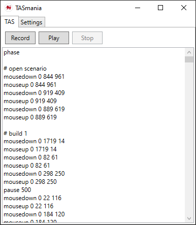

# TASmania

TASmania is a tool for creating tool-assisted speedruns on Windows. It can record a series of mouse and keyboard inputs and then play them back at high speed.

## Download

Visit the [Releases](//github.com/kendfrey/TASmania/releases) page to download the latest version.

## Commands

- `mousemove <x> <y>` - Moves the cursor to the pixel coordinates `<x>` and `<y>`.
- `mousedown <button> <x> <y>` - Presses a mouse button at `<x>` and `<y>`. `<button>` can be `0` for the left button, `1` for the right button, or `2` for the middle button.
- `mouseup <button> <x> <y>` - Releases a mouse button at `<x>` and `<y>`.
- `mousewheel <delta>` - Scrolls the mouse wheel `<delta>` clicks. Positive numbers scroll up, and negative numbers scroll down.
- `keydown <code>` - Presses the key with the scancode `<code>`.
- `keyup <code>` - Releases the key with the scancode `<code>`.
- `pause <ms>` - Waits for `<ms>` milliseconds before executing the next command.
- `setdelay <ms>` - Sets the delay between commands to `<ms>` milliseconds. Commands after this point will wait for the given delay. The default delay is 0ms.
- `phase` - Waits for the user to press the "Next phase" hotkey before executing the next command.
